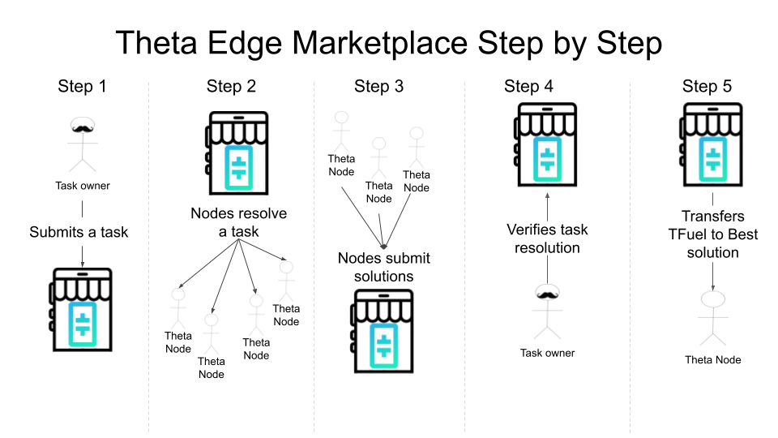

# **Theta Edge Marketplace**

This project is a proof-of-concept named **Theta Edge Marketplace**: a Decentralized Application (DAPP) that bridges Blockchain and Distributed Computation, implementing BNN training. Using smart contracts, a user can submit a task to the Theta Network, then encourage those with sufficient resources to solve tasks and use IPFS to upload their results. Fig. 1 shows the general idea.

Explanation on how to run the Neural Network, check [BNN-Task](BNN-Task/README.txt): 

Theta Smart Contract Address
[0x01eaca027c07e6e6891f30926e80876f40505a4d](https://smart-contracts-sandbox-explorer.thetatoken.org/account/0x01eaca027c07e6e6891f30926e80876f40505a4d)

[Webpage: thetaedgemarketplace.on.fleek.co](thetaedgemarketplace.on.fleek.co)

[IPFS Hash: QmX3pGBAQE6PQiPtd38T2FRi9i59E9CsgK6nVMhV6xJ8Yy](https://explore.ipld.io/#/explore/QmX3pGBAQE6PQiPtd38T2FRi9i59E9CsgK6nVMhV6xJ8Yy)

DevPost Project
[https://devpost.com/software/theta-edge-compute-market-with-neural-networks](https://devpost.com/software/theta-edge-compute-market-with-neural-networks)
