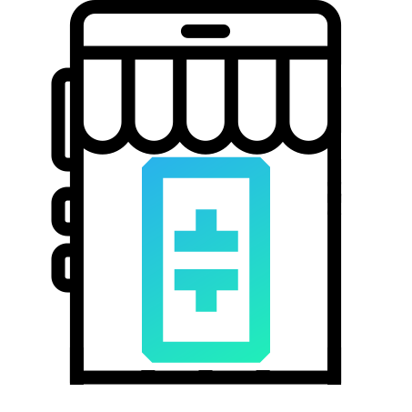

# **Theta Edge Marketplace**

This project is a proof-of-concept named **Theta Edge Marketplace**: a Decentralized Application (DAPP) that bridges Blockchain and Distributed Computation, implementing BNN training. Using smart contracts, a user can submit a task to the Theta Network, then encourage those with sufficient resources to solve tasks and use IPFS to upload their results. Fig. 1 shows the general idea.

